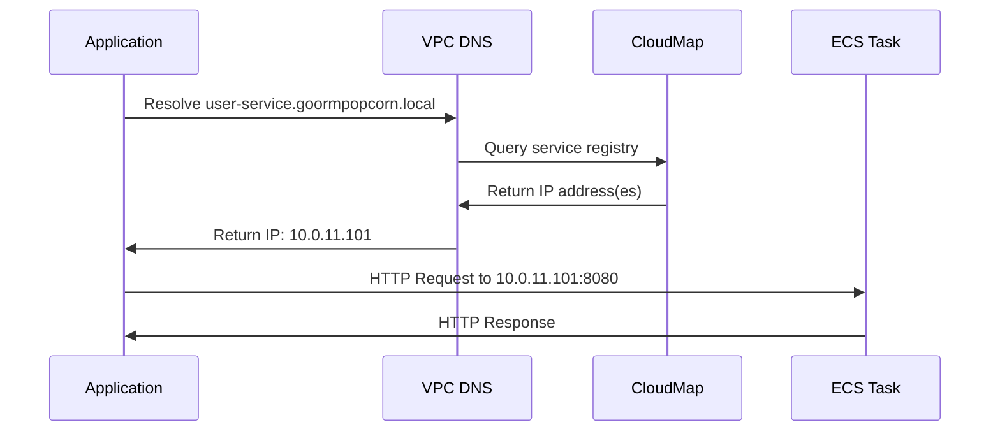
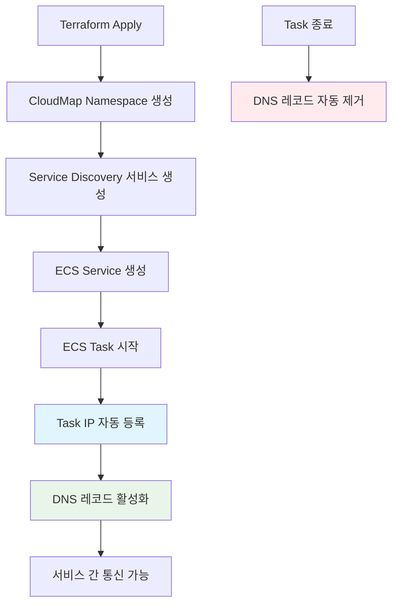

# AWS CloudMap 서비스 디스커버리 가이드

**프로젝트**: Goorm Popcorn Infrastructure  
**작성일**: 2024-01-26  
**버전**: 1.0  

---

## 목차

1. [개요](#1-개요)
2. [아키텍처](#2-아키텍처)
3. [Terraform 구성](#3-terraform-구성)
4. [서비스 등록 과정](#4-서비스-등록-과정)
5. [애플리케이션 통합](#5-애플리케이션-통합)
6. [모니터링 및 디버깅](#6-모니터링-및-디버깅)
7. [트러블슈팅](#7-트러블슈팅)
8. [베스트 프랙티스](#8-베스트-프랙티스)

---

## 1. 개요

### 1.1 AWS CloudMap이란?

AWS CloudMap은 클라우드 리소스를 위한 서비스 디스커버리 서비스입니다. 마이크로서비스 아키텍처에서 서비스 간 통신을 위해 동적으로 서비스 위치를 찾을 수 있게 해줍니다.

### 1.2 Goorm Popcorn에서의 활용

- **네임스페이스**: `goormpopcorn.local`
- **서비스 수**: 7개 (API Gateway + 6개 마이크로서비스)
- **통신 방식**: DNS 기반 서비스 디스커버리
- **통합**: ECS Fargate와 자동 연동

### 1.3 지원 서비스 목록

```yaml
서비스 목록:
  - api-gateway.goormpopcorn.local
  - user-service.goormpopcorn.local
  - store-service.goormpopcorn.local
  - order-service.goormpopcorn.local
  - payment-service.goormpopcorn.local
  - qr-service.goormpopcorn.local
  - order-query.goormpopcorn.local
```

---

## 2. 아키텍처

### 2.1 전체 아키텍처

```
┌─────────────────────────────────────────────────────────────┐
│                    VPC (10.0.0.0/16)                       │
│                                                             │
│  ┌─────────────────────────────────────────────────────┐    │
│  │            CloudMap Namespace                       │    │
│  │          goormpopcorn.local                         │    │
│  │                                                     │    │
│  │  ┌─────────────────┐  ┌─────────────────┐          │    │
│  │  │  ECS Service 1  │  │  ECS Service 2  │   ...    │    │
│  │  │                 │  │                 │          │    │
│  │  │  Task IP:       │  │  Task IP:       │          │    │
│  │  │  10.0.11.100    │  │  10.0.11.101    │          │    │
│  │  └─────────────────┘  └─────────────────┘          │    │
│  │           │                     │                  │    │
│  │           └─────────┬───────────┘                  │    │
│  │                     │                              │    │
│  │              Auto Registration                     │    │
│  │                     │                              │    │
│  │  ┌─────────────────────────────────────────────┐   │    │
│  │  │           DNS Records                       │   │    │
│  │  │                                             │   │    │
│  │  │  api-gateway.goormpopcorn.local → IP       │   │    │
│  │  │  user-service.goormpopcorn.local → IP      │   │    │
│  │  │  store-service.goormpopcorn.local → IP     │   │    │
│  │  │  ...                                        │   │    │
│  │  └─────────────────────────────────────────────┘   │    │
│  └─────────────────────────────────────────────────────┘    │
└─────────────────────────────────────────────────────────────┘
```

### 2.2 서비스 디스커버리 플로우



---

## 3. Terraform 구성

### 3.1 CloudMap 모듈 구조

```
modules/cloudmap/
├── main.tf          # 메인 리소스 정의
├── variables.tf     # 입력 변수
├── outputs.tf       # 출력 값
└── versions.tf      # 프로바이더 버전
```

### 3.2 주요 리소스

#### **Private DNS Namespace**
```hcl
resource "aws_service_discovery_private_dns_namespace" "main" {
  name        = var.namespace_name  # "goormpopcorn.local"
  description = "Service discovery namespace for ${var.name}"
  vpc         = var.vpc_id

  tags = merge(local.base_tags, {
    Name = "${var.name}-service-discovery"
  })
}
```

#### **Service Discovery Services**
```hcl
resource "aws_service_discovery_service" "services" {
  for_each = toset(var.service_names)

  name = each.key

  dns_config {
    namespace_id = aws_service_discovery_private_dns_namespace.main.id

    dns_records {
      ttl  = var.dns_ttl  # 60초
      type = "A"
    }

    routing_policy = "MULTIVALUE"
  }

  tags = merge(local.base_tags, {
    Name    = "${var.name}-${each.key}-service"
    Service = each.key
  })
}
```

### 3.3 변수 설정

#### **필수 변수**
```hcl
variable "name" {
  description = "Base name for CloudMap resources"
  type        = string
}

variable "vpc_id" {
  description = "VPC ID for the private DNS namespace"
  type        = string
}
```

#### **선택적 변수**
```hcl
variable "namespace_name" {
  description = "Name of the private DNS namespace"
  type        = string
  default     = "goormpopcorn.local"
}

variable "service_names" {
  description = "List of service names to register"
  type        = list(string)
  default     = [
    "api-gateway",
    "user-service", 
    "store-service",
    "order-service",
    "payment-service",
    "qr-service",
    "order-query"
  ]
}

variable "dns_ttl" {
  description = "DNS TTL in seconds"
  type        = number
  default     = 60
}
```

### 3.4 출력 값

```hcl
output "namespace_id" {
  description = "ID of the private DNS namespace"
  value       = aws_service_discovery_private_dns_namespace.main.id
}

output "service_arns" {
  description = "ARNs of the service discovery services"
  value = {
    for k, v in aws_service_discovery_service.services : k => v.arn
  }
}

output "service_ids" {
  description = "IDs of the service discovery services"
  value = {
    for k, v in aws_service_discovery_service.services : k => v.id
  }
}
```

---

## 4. 서비스 등록 과정

### 4.1 자동 등록 플로우



### 4.2 ECS Service 연동

#### **Service Registry 설정**
```hcl
# ECS Service에서 CloudMap 연동
resource "aws_ecs_service" "services" {
  for_each = var.services

  # ... 기본 설정 ...

  dynamic "service_registries" {
    for_each = lookup(var.service_discovery_service_arns, each.key, null) != null ? [1] : []
    content {
      registry_arn = var.service_discovery_service_arns[each.key]
    }
  }
}
```

#### **Health Check 설정**
```hcl
healthCheck = {
  command = [
    "CMD-SHELL",
    "curl -f http://localhost:8080/actuator/health || exit 1"
  ]
  interval    = 30
  timeout     = 5
  retries     = 3
  startPeriod = 60
}
```

### 4.3 등록 확인

#### **DNS 레코드 예시**
```bash
# 등록되는 DNS 레코드들
api-gateway.goormpopcorn.local     A    10.0.11.100
user-service.goormpopcorn.local    A    10.0.11.101
store-service.goormpopcorn.local   A    10.0.11.102
order-service.goormpopcorn.local   A    10.0.11.103
payment-service.goormpopcorn.local A    10.0.11.104
qr-service.goormpopcorn.local      A    10.0.11.105
order-query.goormpopcorn.local     A    10.0.11.106
```

#### **Multi-AZ 환경에서의 등록**
```bash
# Prod 환경 (Multi-AZ)에서는 여러 IP가 등록됨
user-service.goormpopcorn.local    A    10.0.11.101
user-service.goormpopcorn.local    A    10.0.12.101
```

---

## 5. 애플리케이션 통합

### 5.1 Spring Boot 설정

#### **application.yml**
```yaml
# 환경별 설정
spring:
  profiles:
    active: ${SPRING_PROFILES_ACTIVE:dev}

---
# Dev 환경
spring:
  config:
    activate:
      on-profile: dev
  
services:
  user-service:
    url: http://user-service.goormpopcorn.local:8080
  store-service:
    url: http://store-service.goormpopcorn.local:8080
  order-service:
    url: http://order-service.goormpopcorn.local:8080
  payment-service:
    url: http://payment-service.goormpopcorn.local:8080
  qr-service:
    url: http://qr-service.goormpopcorn.local:8080
  order-query:
    url: http://order-query.goormpopcorn.local:8080

---
# Prod 환경
spring:
  config:
    activate:
      on-profile: prod
      
services:
  user-service:
    url: http://user-service.goormpopcorn.local:8080
  # ... 동일한 URL 사용
```

### 5.2 Spring Cloud Gateway 설정

#### **Gateway Routes**
```yaml
spring:
  cloud:
    gateway:
      routes:
        - id: user-service
          uri: http://user-service.goormpopcorn.local:8080
          predicates:
            - Path=/api/users/**
          filters:
            - AuthenticationFilter
            - RateLimitFilter
        
        - id: store-service
          uri: http://store-service.goormpopcorn.local:8080
          predicates:
            - Path=/api/stores/**
          filters:
            - AuthenticationFilter
        
        - id: order-service
          uri: http://order-service.goormpopcorn.local:8080
          predicates:
            - Path=/api/orders/**
          filters:
            - AuthenticationFilter
            - RateLimitFilter
        
        - id: payment-service
          uri: http://payment-service.goormpopcorn.local:8080
          predicates:
            - Path=/api/payments/**
          filters:
            - AuthenticationFilter
            - name: CircuitBreaker
              args:
                name: paymentCB
        
        - id: qr-service
          uri: http://qr-service.goormpopcorn.local:8080
          predicates:
            - Path=/api/qr/**
          filters:
            - AuthenticationFilter

        - id: order-query
          uri: http://order-query.goormpopcorn.local:8080
          predicates:
            - Path=/api/order-query/**
          filters:
            - AuthenticationFilter
```

### 5.3 Java 클라이언트 예시

#### **RestTemplate 사용**
```java
@Component
public class UserServiceClient {
    
    @Value("${services.user-service.url}")
    private String userServiceUrl;
    
    private final RestTemplate restTemplate;
    
    public UserServiceClient(RestTemplate restTemplate) {
        this.restTemplate = restTemplate;
    }
    
    public User getUser(String userId) {
        String url = userServiceUrl + "/api/users/" + userId;
        return restTemplate.getForObject(url, User.class);
    }
    
    public List<User> getUsers() {
        String url = userServiceUrl + "/api/users";
        return restTemplate.exchange(
            url, 
            HttpMethod.GET, 
            null, 
            new ParameterizedTypeReference<List<User>>() {}
        ).getBody();
    }
}
```

#### **WebClient 사용 (권장)**
```java
@Component
public class StoreServiceClient {
    
    private final WebClient webClient;
    
    public StoreServiceClient(@Value("${services.store-service.url}") String baseUrl) {
        this.webClient = WebClient.builder()
            .baseUrl(baseUrl)
            .defaultHeader(HttpHeaders.CONTENT_TYPE, MediaType.APPLICATION_JSON_VALUE)
            .build();
    }
    
    public Mono<Store> getStore(String storeId) {
        return webClient.get()
            .uri("/api/stores/{storeId}", storeId)
            .retrieve()
            .bodyToMono(Store.class);
    }
    
    public Flux<Store> getStores() {
        return webClient.get()
            .uri("/api/stores")
            .retrieve()
            .bodyToFlux(Store.class);
    }
}
```

### 5.4 Kafka 클라이언트 설정

#### **Producer 설정**
```java
@Configuration
public class KafkaProducerConfig {
    
    @Value("${kafka.bootstrap-servers:kafka-1.goormpopcorn.local:9092,kafka-2.goormpopcorn.local:9092,kafka-3.goormpopcorn.local:9092}")
    private String bootstrapServers;
    
    @Bean
    public ProducerFactory<String, Object> producerFactory() {
        Map<String, Object> props = new HashMap<>();
        props.put(ProducerConfig.BOOTSTRAP_SERVERS_CONFIG, bootstrapServers);
        props.put(ProducerConfig.KEY_SERIALIZER_CLASS_CONFIG, StringSerializer.class);
        props.put(ProducerConfig.VALUE_SERIALIZER_CLASS_CONFIG, JsonSerializer.class);
        return new DefaultKafkaProducerFactory<>(props);
    }
}
```

---

## 6. 모니터링 및 디버깅

### 6.1 AWS CLI 명령어

#### **네임스페이스 조회**
```bash
# 모든 네임스페이스 조회
aws servicediscovery list-namespaces

# 특정 네임스페이스 상세 조회
aws servicediscovery get-namespace --id <namespace-id>
```

#### **서비스 조회**
```bash
# 네임스페이스 내 서비스 목록
aws servicediscovery list-services \
  --filters Name=NAMESPACE_ID,Values=<namespace-id>

# 특정 서비스 상세 조회
aws servicediscovery get-service --id <service-id>
```

#### **인스턴스 조회**
```bash
# 서비스에 등록된 인스턴스 목록
aws servicediscovery list-instances --service-id <service-id>

# 특정 인스턴스 상세 조회
aws servicediscovery get-instance \
  --service-id <service-id> \
  --instance-id <instance-id>
```

### 6.2 DNS 테스트

#### **ECS Task 내부에서 테스트**
```bash
# ECS Task에 접속
aws ecs execute-command \
  --cluster goorm-popcorn-dev-cluster \
  --task <task-arn> \
  --container api-gateway \
  --interactive \
  --command "/bin/bash"

# DNS 조회 테스트
nslookup user-service.goormpopcorn.local
dig user-service.goormpopcorn.local
host user-service.goormpopcorn.local

# HTTP 연결 테스트
curl -f http://user-service.goormpopcorn.local:8080/actuator/health
wget -qO- http://store-service.goormpopcorn.local:8080/actuator/info
```

#### **로컬에서 테스트 (VPN 연결 시)**
```bash
# VPC 내부에서만 접근 가능
# Bastion Host 또는 VPN 연결 필요

# DNS 서버 설정 (VPC DNS 서버 사용)
# /etc/resolv.conf
nameserver 10.0.0.2  # VPC DNS 서버

# 테스트
nslookup user-service.goormpopcorn.local 10.0.0.2
```

### 6.3 CloudWatch 로그 확인

#### **ECS 로그 그룹**
```bash
# 로그 그룹 목록
aws logs describe-log-groups --log-group-name-prefix "/aws/ecs/goorm-popcorn"

# 특정 서비스 로그 확인
aws logs get-log-events \
  --log-group-name "/aws/ecs/goorm-popcorn-dev/user-service" \
  --log-stream-name <log-stream-name>
```

#### **Service Discovery 이벤트**
```bash
# CloudTrail에서 Service Discovery 이벤트 확인
aws logs filter-log-events \
  --log-group-name "CloudTrail/ServiceDiscovery" \
  --filter-pattern "{ $.eventSource = servicediscovery.amazonaws.com }"
```

---

## 7. 트러블슈팅

### 7.1 일반적인 문제들

#### **문제 1: DNS 해석 실패**
```bash
# 증상
nslookup: can't resolve 'user-service.goormpopcorn.local'

# 원인
- CloudMap 서비스가 생성되지 않음
- ECS Task가 서비스에 등록되지 않음
- VPC DNS 설정 문제

# 해결방법
1. CloudMap 서비스 상태 확인
aws servicediscovery list-services --filters Name=NAMESPACE_ID,Values=<namespace-id>

2. ECS Task 등록 상태 확인
aws servicediscovery list-instances --service-id <service-id>

3. VPC DNS 설정 확인
aws ec2 describe-vpcs --vpc-ids <vpc-id>
# enableDnsHostnames: true
# enableDnsSupport: true
```

#### **문제 2: 서비스 등록 실패**
```bash
# 증상
ECS Task는 실행되지만 CloudMap에 등록되지 않음

# 원인
- ECS Service에 service_registries 설정 누락
- IAM 권한 부족
- Health Check 실패

# 해결방법
1. ECS Service 설정 확인
aws ecs describe-services --cluster <cluster-name> --services <service-name>

2. IAM 역할 권한 확인
{
  "Version": "2012-10-17",
  "Statement": [
    {
      "Effect": "Allow",
      "Action": [
        "servicediscovery:RegisterInstance",
        "servicediscovery:DeregisterInstance",
        "servicediscovery:DiscoverInstances"
      ],
      "Resource": "*"
    }
  ]
}

3. Health Check 로그 확인
aws logs get-log-events --log-group-name "/aws/ecs/goorm-popcorn-dev/user-service"
```

#### **문제 3: 간헐적 연결 실패**
```bash
# 증상
가끔씩 서비스 간 통신이 실패함

# 원인
- DNS TTL 설정 문제
- 로드 밸런싱 이슈
- Task 재시작으로 인한 IP 변경

# 해결방법
1. DNS TTL 단축 (60초 → 30초)
dns_records {
  ttl  = 30
  type = "A"
}

2. Connection Pool 설정
# Spring Boot
spring:
  datasource:
    hikari:
      maximum-pool-size: 10
      connection-timeout: 30000

3. Retry 로직 구현
@Retryable(value = {ConnectException.class}, maxAttempts = 3)
public User getUser(String userId) {
    // 서비스 호출 로직
}
```

### 7.2 디버깅 도구

#### **CloudMap 상태 확인 스크립트**
```bash
#!/bin/bash
# cloudmap-debug.sh

NAMESPACE_NAME="goormpopcorn.local"
SERVICES=("api-gateway" "user-service" "store-service" "order-service" "payment-service" "qr-service" "order-query")

echo "=== CloudMap Debug Information ==="

# 네임스페이스 조회
echo "1. Namespace Information:"
NAMESPACE_ID=$(aws servicediscovery list-namespaces \
  --query "Namespaces[?Name=='$NAMESPACE_NAME'].Id" \
  --output text)

if [ -z "$NAMESPACE_ID" ]; then
  echo "ERROR: Namespace '$NAMESPACE_NAME' not found"
  exit 1
fi

echo "Namespace ID: $NAMESPACE_ID"

# 서비스 목록 조회
echo -e "\n2. Services:"
for service in "${SERVICES[@]}"; do
  echo "Checking service: $service"
  
  SERVICE_ID=$(aws servicediscovery list-services \
    --filters Name=NAMESPACE_ID,Values=$NAMESPACE_ID \
    --query "Services[?Name=='$service'].Id" \
    --output text)
  
  if [ -z "$SERVICE_ID" ]; then
    echo "  ERROR: Service '$service' not found"
    continue
  fi
  
  echo "  Service ID: $SERVICE_ID"
  
  # 인스턴스 조회
  INSTANCES=$(aws servicediscovery list-instances \
    --service-id $SERVICE_ID \
    --query "Instances[].Attributes.AWS_INSTANCE_IPV4" \
    --output text)
  
  if [ -z "$INSTANCES" ]; then
    echo "  WARNING: No instances registered"
  else
    echo "  Registered IPs: $INSTANCES"
  fi
done

echo -e "\n3. DNS Test:"
for service in "${SERVICES[@]}"; do
  echo "Testing DNS for $service.goormpopcorn.local"
  nslookup $service.goormpopcorn.local || echo "  DNS resolution failed"
done
```

#### **Health Check 스크립트**
```bash
#!/bin/bash
# health-check.sh

SERVICES=("api-gateway" "user-service" "store-service" "order-service" "payment-service" "qr-service" "order-query")

echo "=== Service Health Check ==="

for service in "${SERVICES[@]}"; do
  echo "Checking health for $service:"
  
  URL="http://$service.goormpopcorn.local:8080/actuator/health"
  
  if curl -f -s --connect-timeout 5 --max-time 10 $URL > /dev/null; then
    echo "  ✅ $service is healthy"
  else
    echo "  ❌ $service is unhealthy or unreachable"
    
    # 상세 정보 확인
    echo "  Detailed check:"
    curl -v --connect-timeout 5 --max-time 10 $URL 2>&1 | head -10
  fi
  
  echo ""
done
```

---

## 8. 베스트 프랙티스

### 8.1 설계 원칙

#### **네이밍 컨벤션**
```yaml
네임스페이스: {project}.local
서비스: {service-name}.{project}.local

예시:
- goormpopcorn.local
- user-service.goormpopcorn.local
- store-service.goormpopcorn.local
```

#### **DNS TTL 설정**
```yaml
개발 환경: 30-60초 (빠른 변경 반영)
프로덕션: 60-300초 (안정성 우선)

권장값:
- Dev: 30초
- Prod: 60초
```

#### **Health Check 설정**
```yaml
interval: 30초
timeout: 5초
retries: 3회
startPeriod: 60초

엔드포인트: /actuator/health (Spring Boot)
```

### 8.2 보안 고려사항

#### **네트워크 격리**
```yaml
Private DNS Namespace 사용:
- VPC 내부에서만 접근 가능
- 외부 인터넷에서 직접 접근 불가
- Security Group으로 추가 제어
```

#### **IAM 권한 최소화**
```json
{
  "Version": "2012-10-17",
  "Statement": [
    {
      "Effect": "Allow",
      "Action": [
        "servicediscovery:RegisterInstance",
        "servicediscovery:DeregisterInstance"
      ],
      "Resource": "arn:aws:servicediscovery:*:*:service/*"
    }
  ]
}
```

### 8.3 성능 최적화

#### **Connection Pooling**
```java
// HTTP Client 설정
@Bean
public RestTemplate restTemplate() {
    HttpComponentsClientHttpRequestFactory factory = 
        new HttpComponentsClientHttpRequestFactory();
    
    factory.setConnectTimeout(5000);
    factory.setReadTimeout(10000);
    
    // Connection Pool 설정
    PoolingHttpClientConnectionManager connectionManager = 
        new PoolingHttpClientConnectionManager();
    connectionManager.setMaxTotal(100);
    connectionManager.setDefaultMaxPerRoute(20);
    
    CloseableHttpClient httpClient = HttpClients.custom()
        .setConnectionManager(connectionManager)
        .build();
    
    factory.setHttpClient(httpClient);
    return new RestTemplate(factory);
}
```

#### **Circuit Breaker 패턴**
```java
@Component
public class UserServiceClient {
    
    @CircuitBreaker(name = "user-service", fallbackMethod = "fallbackGetUser")
    @Retry(name = "user-service")
    @TimeLimiter(name = "user-service")
    public CompletableFuture<User> getUser(String userId) {
        return CompletableFuture.supplyAsync(() -> {
            String url = userServiceUrl + "/api/users/" + userId;
            return restTemplate.getForObject(url, User.class);
        });
    }
    
    public CompletableFuture<User> fallbackGetUser(String userId, Exception ex) {
        return CompletableFuture.completedFuture(new User(userId, "Unknown"));
    }
}
```

### 8.4 모니터링 설정

#### **CloudWatch 메트릭**
```yaml
모니터링 대상:
- DNS 쿼리 수
- 서비스 등록/해제 이벤트
- Health Check 실패율
- 응답 시간

알람 설정:
- 서비스 등록 실패 > 5회/5분
- DNS 해석 실패율 > 10%
- Health Check 실패율 > 20%
```

#### **로그 수집**
```yaml
로그 레벨:
- INFO: 서비스 등록/해제
- WARN: DNS 해석 실패
- ERROR: 연결 실패

로그 보존:
- Dev: 7일
- Prod: 30일
```

---

## 9. 참고 자료

### 9.1 AWS 문서
- [AWS Cloud Map Developer Guide](https://docs.aws.amazon.com/cloud-map/)
- [ECS Service Discovery](https://docs.aws.amazon.com/AmazonECS/latest/developerguide/service-discovery.html)
- [VPC DNS Resolution](https://docs.aws.amazon.com/vpc/latest/userguide/vpc-dns.html)

### 9.2 Spring 문서
- [Spring Cloud Gateway](https://spring.io/projects/spring-cloud-gateway)
- [Spring Boot Actuator](https://docs.spring.io/spring-boot/docs/current/reference/html/actuator.html)
- [Spring Cloud Circuit Breaker](https://spring.io/projects/spring-cloud-circuitbreaker)

### 9.3 내부 문서
- `requirements.md` - 프로젝트 요구사항
- `design.md` - 전체 시스템 설계
- `troubleshooting-log-2024-01-26.md` - 문제 해결 로그

---

**문서 버전**: 1.0  
**최종 수정일**: 2024-01-26  
**작성자**: Infrastructure Team  
**검토자**: Tech Lead, DevOps Lead  
**다음 리뷰**: 배포 완료 후